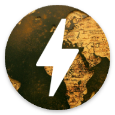
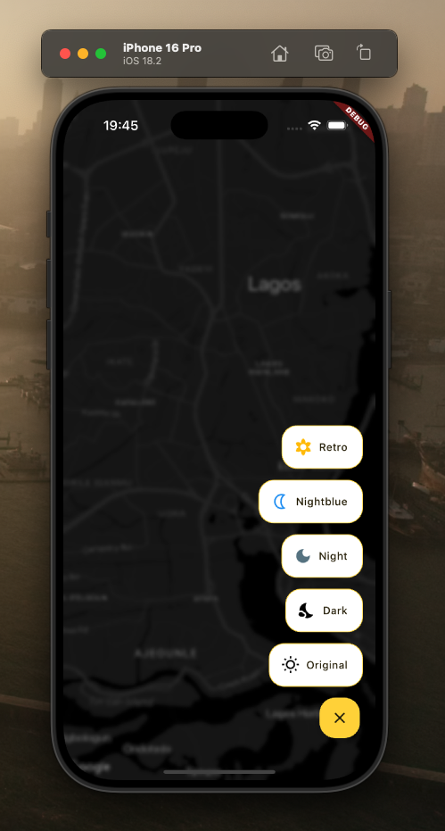
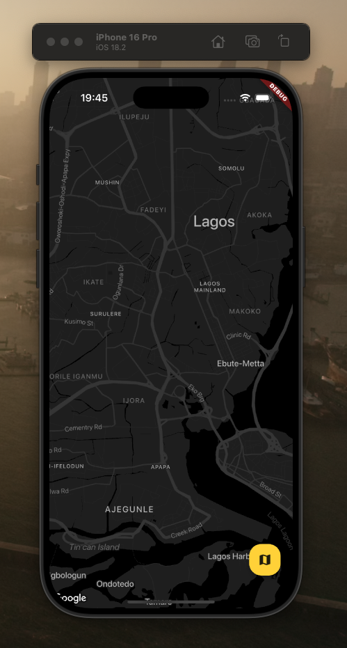
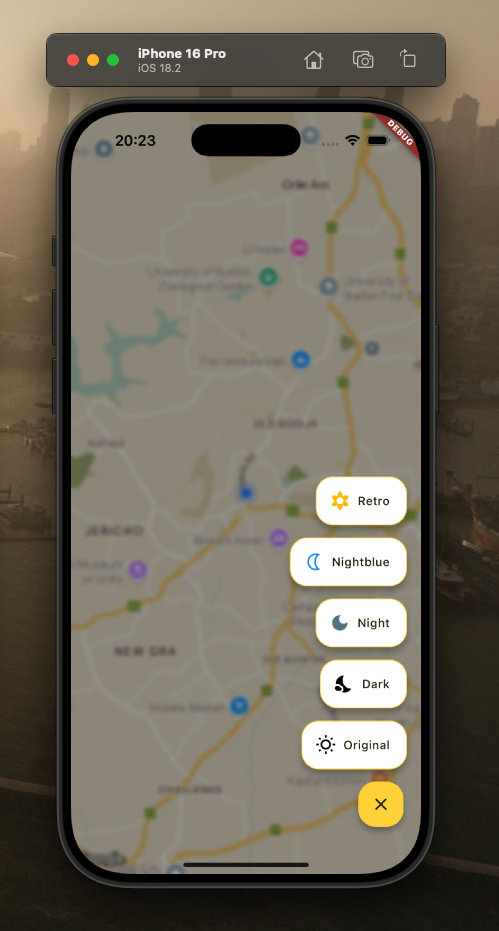
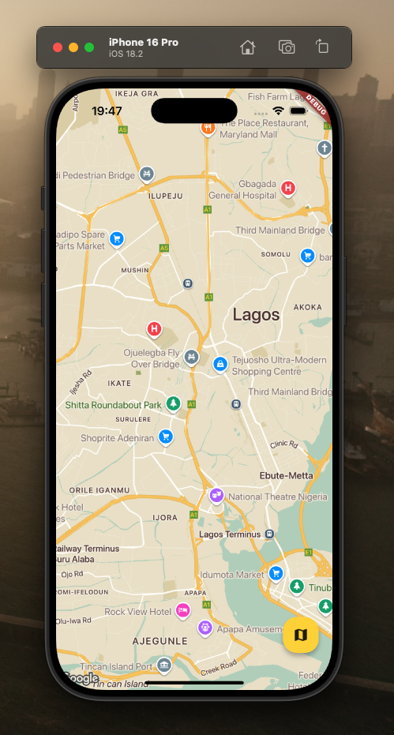
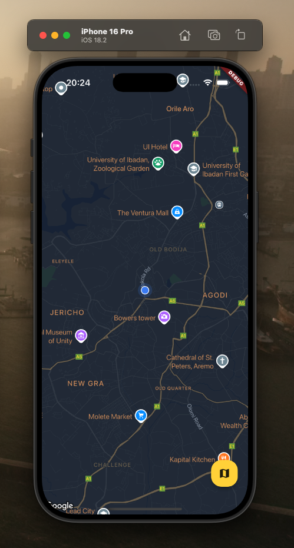
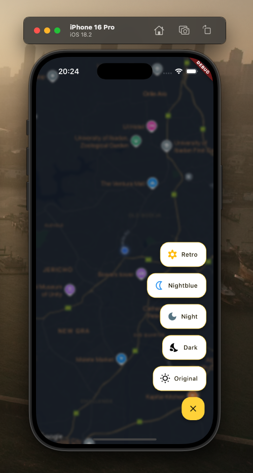
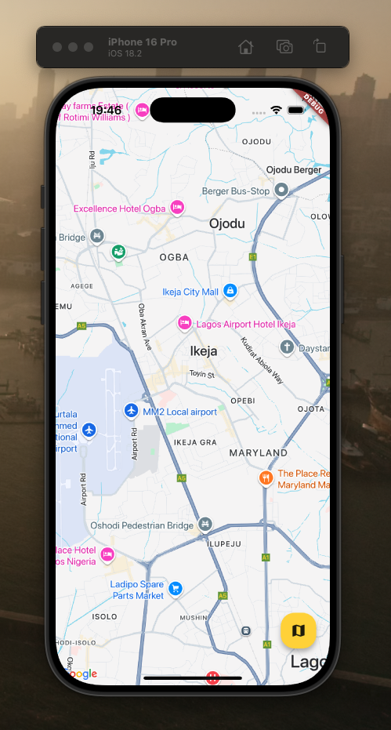
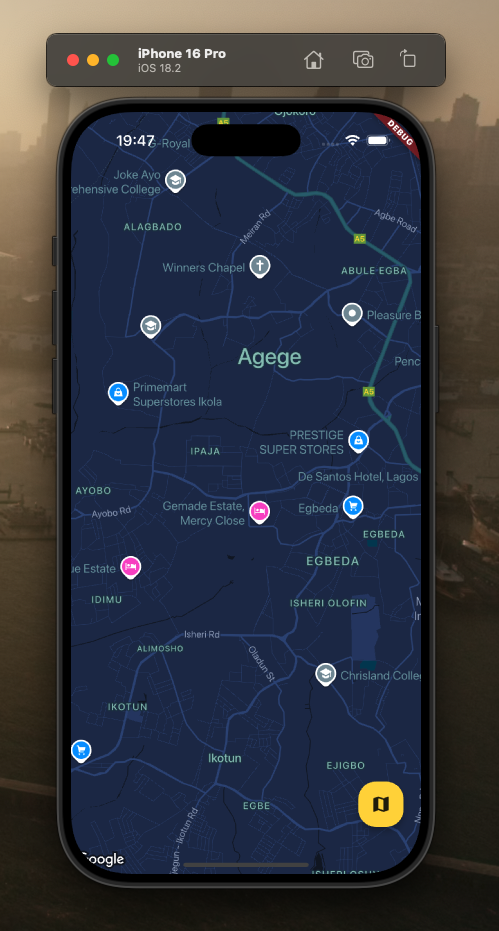

# Dynamic Google Map Themes with Riverpod

<div align="center">
   

<strong> This project demonstrates how to implement dynamic Google Map theming in a Flutter app using Riverpod for state management. Users can seamlessly switch between different map styles (e.g., light, dark, retro) based on app theme or user preference. </strong>

<br/>

[Click to download APK here!!](https://drive.google.com/file/d/1__dRUHI7zh9f78qZW5tRwxTgSJVXDj_i/view?usp=sharing)

<sub>Built by <a href="https://twitter.com/_Captured_Heart">Nkpozi Marcel Kelechi (X: @Captured-Heart)</a></sub>
<br />

## AN INTRO VIDEO OF THE APP

# Demo (What to test)

<div align="left">
- Tap the Floating action button on the bottom right, it expands<br/>
- On expanded, you can click on any of the styles. Voila 🥳<br/>
</div>

</div>

---

## Getting Started

After cloning,

### FVM setup

it runs on flutter version: <br> flutter: ">=3.27.0" <br> dart: ">=3.7.0 <4.0.0"

Install `fvm` if not already installed.

```bash
dart pub global activate fvm
```

Install the local `flutter` version.

```bash
fvm install
```

---

# Key Features

1. Themed Map:

   - Automatically applies custom Google Map styles based on the selected app theme (light/dark) or user preference, enhancing visual consistency throughout the app.

2. Dynamic Theme Switching

   - Users can switch between themes in real-time, with immediate reflection on the Google Map appearance.

3. Modular Design

   - Clean separation of concerns with reusable providers, making it easy to extend or integrate into existing Flutter projects.

## UI Shots

<div style="text-align: center">
  <table>
    <tr>
      <td style="text-align: center">
        
      </td>
      <td style="text-align: center">
        
      </td>
       <td style="text-align: center">
        
      </td> <td style="text-align: center">
        
      </td>
    </tr>
     <tr>
      <td style="text-align: center">
        
      </td>
      <td style="text-align: center">
        
      </td>
       <td style="text-align: center">
        
      </td> <td style="text-align: center">
        
      </td>
    </tr>
  </table>
</div>

## Tools

- [Shared_Preferences](https://pub.dev/packages/shared_preferences): Wraps platform-specific persistent storage for simple data (NSUserDefaults on iOS and macOS, SharedPreferences on Android, etc.)
- [Flutter_Riverpod](https://pub.dev/packages/flutter_riverpod): A reactive caching and data-binding framework.
- [Geolocator](https://pub.dev/packages/geolocator): A Flutter geolocation plugin which provides easy access to platform-specific location services.
- [Google_Maps_Flutter](https://pub.dev/packages/google_maps_flutter): A Flutter plugin that provides a Google Maps widget.
- [Flutter_expandable_fab](https://pub.dev/packages/flutter_expandable_fab): A speed dial FAB (Floating Action Button) that can animate the display and hiding of multiple action buttons.
